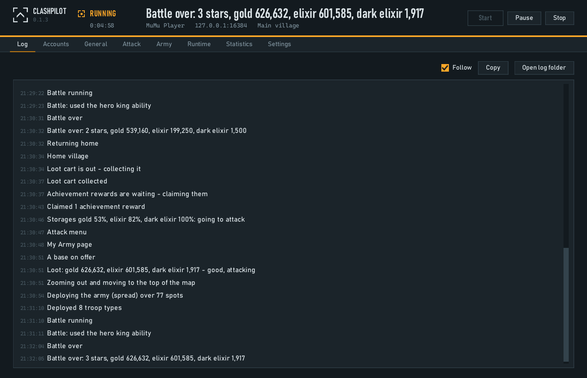
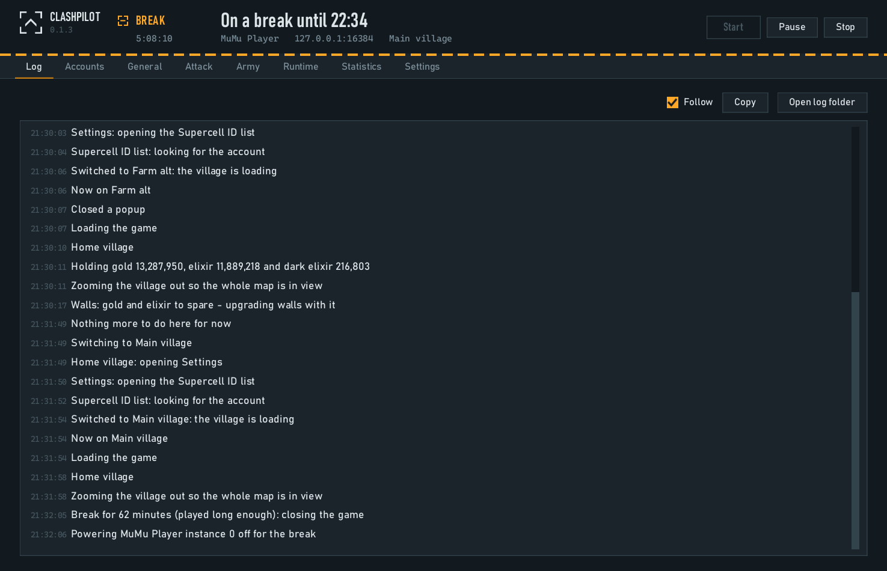
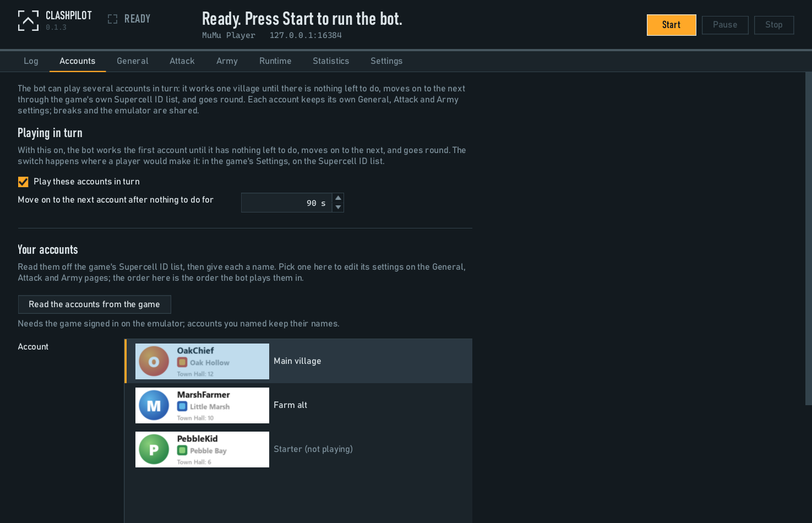
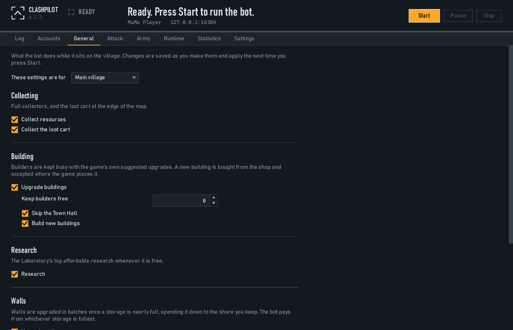
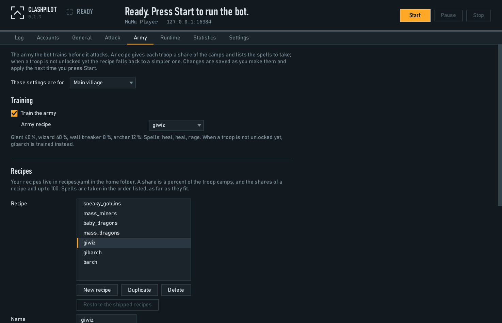
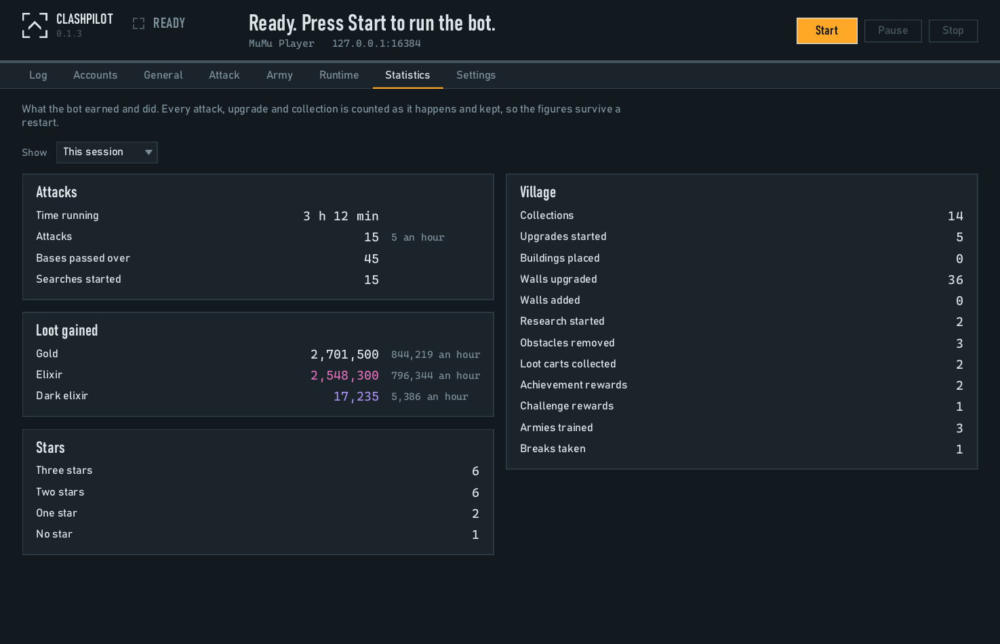
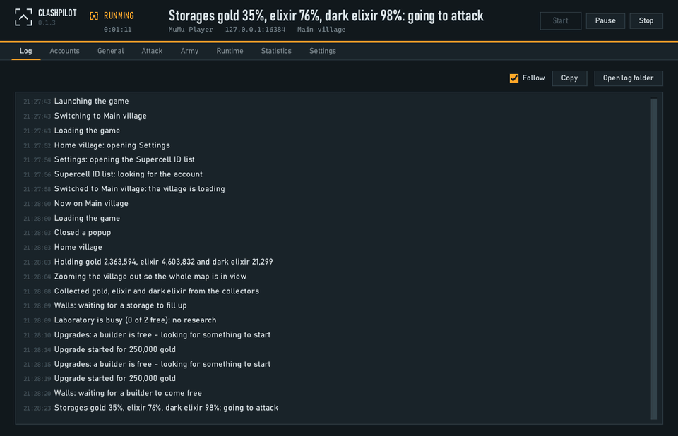

# ClashPilot — Free Clash of Clans Bot for Windows

ClashPilot is a free Clash of Clans bot for Windows. It runs on MuMu Player and plays your village: it collects, builds, researches, upgrades walls, trains an army and attacks for loot. It tells you what it did in plain words and counts what it earned. More at [pilothouse.gg/clash-of-clans-bot](https://pilothouse.gg/clash-of-clans-bot).

  

  <a href="../../releases/latest"><b>Download the latest release</b></a>
  &nbsp;·&nbsp;
  <a href="https://pilothouse.gg/clash-of-clans-bot/download">Download page on pilothouse.gg</a>
  &nbsp;·&nbsp;
  <a href="https://pilothouse.gg/clash-of-clans-bot/guide">Guide</a>

Free. No account, no sign-up. Windows 10 or 11 and MuMu Player.

> [!WARNING]
> Botting breaks Supercell's Terms of Service and accounts can be banned. Use it at your own risk, ideally on a secondary account.

## What this Clash of Clans bot does

Everything on this list is in the free download, and every line is a switch you can turn off.

**In the village**

- Collects your resources and the loot cart
- Keeps your builders busy with upgrades, and can leave some builders free for you
- Builds new buildings when you can afford them, and skips the Town Hall if you want it to
- Starts research whenever the laboratory is free
- Upgrades walls in batches once a storage is nearly full, spending down to a level you choose
- Clears obstacles and claims achievements and challenges

**Army and attack**

- Trains the army from a recipe you choose, with a fallback so a young account always has something to train
- Turns the shares in a recipe into real troop numbers for the camps you have
- Attacks bases that hold at least the gold, elixir and dark elixir you ask for, and presses Next only as often as you allow
- Asks your clan for castle troops before the attack and waits for them
- Drops the whole army round the base and picks reward cards in the order you set
- Reads the stars and the loot when the battle ends

**Builder Base**

- Visits your Builder Base once a turn: collects the bubbles, the Elixir Cart and the Clock Tower's free boost, keeps the Master Builder busy, researches, upgrades walls, and sails back home
- Fights there until the storages are full or for a number of battles, with one troop of your choice in every slot, and stops a battle at the stars you want
- Keeps Builder Base battles in their own place on the Statistics page

**Several accounts**

- Plays several accounts in turn: one village until there is nothing left to do, then the next
- Keeps its own village, attack and army settings for each account
- Takes your accounts from the game itself, so you never type them in

**Pacing**

- Takes breaks the way a person does: closes the game and powers the emulator off for a while, then comes back
- Steps back when you pick up the game on your phone, and comes back a while later
- Keeps the game from disconnecting while it thinks
- No two taps land in quite the same place or at quite the same moment
- Pause means hands off: the game stays open and you can play

**Log and statistics**

- The Log: one plain sentence for each thing it does
- Statistics for this session, today, 7 days, 30 days and all time
- Says what the village is holding on a timer you set

## Requirements

- Windows 10 or 11
- [MuMu Player](https://www.mumuplayer.com/download/), with one instance
- Clash of Clans installed in it, signed in, past the tutorial
- Nothing else to install. ClashPilot sets the emulator up for you the first time.

## Quick start

1. Download the zip from the [latest release](../../releases/latest) and unzip it into a folder of its own. Everything it saves goes there.
2. Open `ClashPilot.exe`. Windows will say the app comes from an unknown publisher the first time: choose **More info**, then **Run anyway**.
3. Choose your MuMu Player instance on the **Settings** page. ClashPilot sets it up.
4. Press **Start**.
5. Watch the **Log**. When ClashPilot cannot carry on by itself, it stops and the window says "Needs you".

The [guide](https://pilothouse.gg/clash-of-clans-bot/guide) walks through every page of the window.

## Screenshots

| | |
|:---:|:---:|
|  **Log**: one plain sentence for each thing it does |  **Accounts**: several villages, played in turn |
|  **General**: what it does in the village |  **Army**: the recipes it trains |
|  **Statistics**: what it earned and did |  **A run**: the Log through two attacks |

## FAQ

### Is ClashPilot free?

Yes. Everything on this page is in the download. No account, no sign-up. A paid tier with more is planned for later.

### Can I get banned for using a Clash of Clans bot?

Yes. Bots are against Supercell's Terms of Service, and an account running one can be banned. ClashPilot's breaks and varied taps lower the risk; nothing removes it. Use an account you can afford to lose.

### Does it work with BlueStacks or LDPlayer?

No. MuMu Player is the only emulator ClashPilot works with today. It finds MuMu Player on your PC, starts it and sets it up for you, and that part exists for MuMu Player only so far. Others may follow.

To switch: install [MuMu Player](https://www.mumuplayer.com/download/), make one instance, install Clash of Clans in it and sign in with your Supercell ID. Your village comes with you. Then point ClashPilot at that instance on its Settings page.

### Does it work with Town Hall 18 / the latest update?

ClashPilot has been run on villages from Town Hall 4 up to Town Hall 15. It has not been tested on higher Town Halls yet; if you run one, tell us on Discord how it goes. When a game update changes a screen, ClashPilot may stop and say "Needs you" until a new version is out. New versions are announced on Discord and listed under [Releases](../../releases).

### Does it need my Supercell ID?

No. You sign in yourself inside the emulator, the same as on a phone. ClashPilot never asks for your Supercell ID or password.

### Can it run multiple accounts?

Yes. It plays your accounts in turn: one village until there is nothing left to do, then the next. It switches the way you would, through the game's own Supercell ID list, so each account only has to be signed in once. Each account keeps its own village, attack and army settings.

## Support

- Questions, setup help and news: [Discord](https://discord.gg/mjanFJ8arv)
- Something went wrong: [open a bug report](../../issues/new/choose) with your version and the last lines of the Log
- Every page of the window explained: [the guide](https://pilothouse.gg/clash-of-clans-bot/guide)
- What changed in each version: [CHANGELOG.md](CHANGELOG.md)

## Disclaimer

Botting breaks Supercell's Terms of Service, and accounts can be banned. You use ClashPilot at your own risk.

ClashPilot is not affiliated with, endorsed, sponsored or approved by Supercell. Clash of Clans is a trademark of Supercell Oy.

ClashPilot is free to use under the terms in [LICENSE](LICENSE). Its source code is not public.
